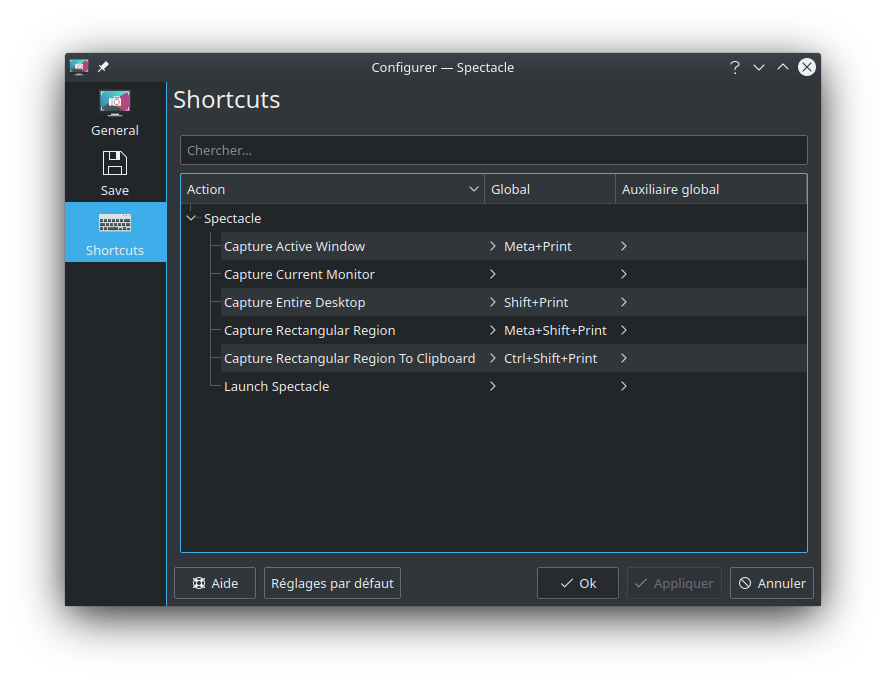

# KDE Spectacle Clipboard Edition

Spectacle is a KDE app. Spectacle Clipboard Edition is a fork
of Spectacle to enable Clipboard features.

## New Features

#### The new feature added it the Clipboard Rectangular Region Screenshot

 - Capture Rectangular Region To Clipboard
 - Capture Active Window To Clipboard

#### Comming soon
 - Capture Current Monitor To Clipboard
 - Capture Entire Desktop To Clipboard

## Help Needed

I need help to translate the new features. The files that need translations are : 
 - [desktop/org.kde.spectacle.appdata.xml](desktop/org.kde.spectacle.appdata.xml)
 - [desktop/org.kde.spectacle.desktop.cmake](desktop/org.kde.spectacle.desktop.cmake)

Only English and French have been done.
